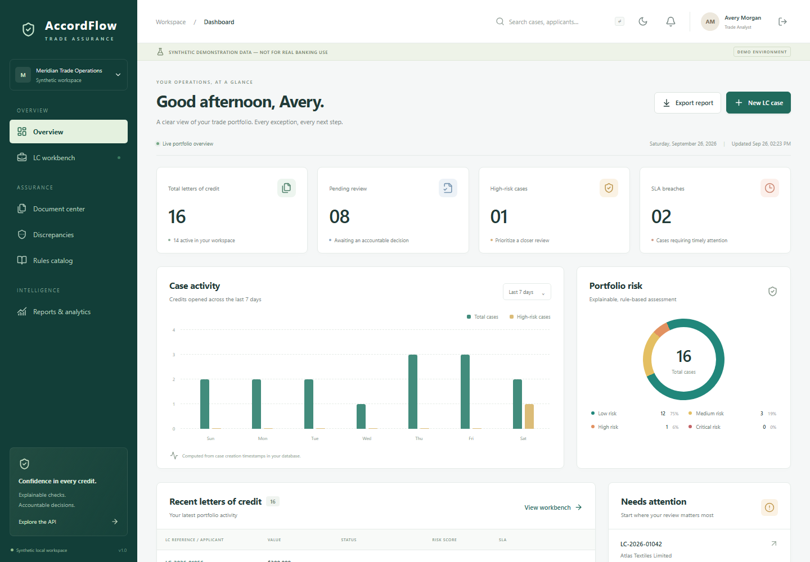
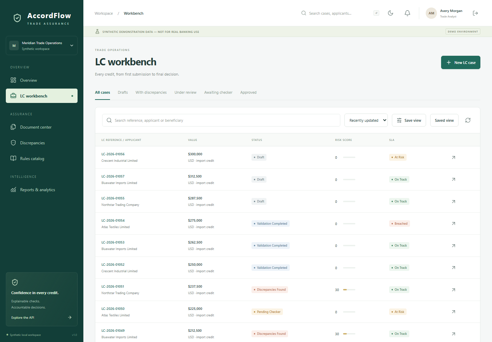
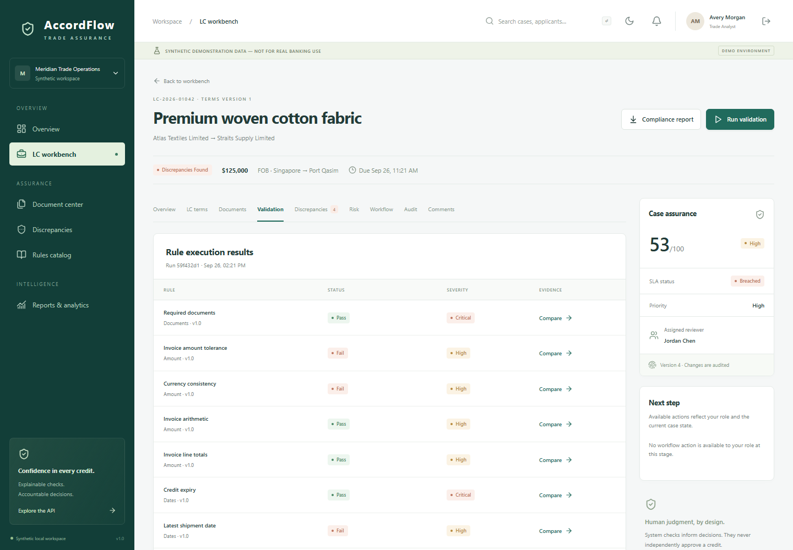
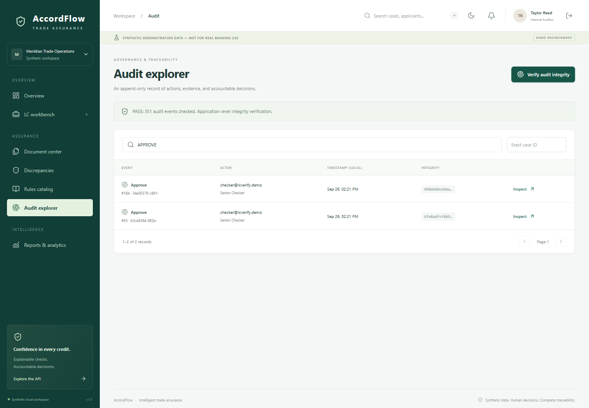
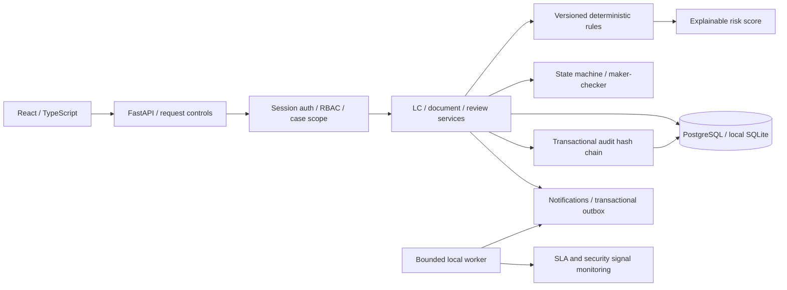

# AccordFlow

**Trade Finance Document Verification**

From document intake to confident decisions: OCR extraction, explainable checks, controlled approvals, and traceable audit records.

> SYNTHETIC DEMONSTRATION DATA — NOT FOR REAL BANKING USE

AccordFlow is a working full-stack portfolio demonstration of documentary-credit operations. An analyst creates a credit and uploads evidence; deterministic rules explain discrepancies; a reviewer investigates; an independent checker decides; the audit chain records what happened.

It is not a certified banking product. The original master prompt is the product vision; [implementation status](docs/IMPLEMENTATION_STATUS.md) distinguishes working features from the remaining scope.

## Application preview

Captured from the running app using a separate, freshly seeded demo database. All names, accounts, and trade records shown are synthetic; no uploaded private documents or credentials are included.

**Operations overview** — portfolio metrics, case activity, risk distribution, and items requiring attention.



<details>
<summary>View the LC workbench, validation results, and audit explorer</summary>

**LC workbench** — searchable cases with workflow status, risk scores, and SLA indicators.



**Document validation** — rule results, severity, evidence comparisons, and case risk.



**Audit explorer** — approval records and an application-level audit integrity check.



</details>

Only these reviewed demo images in `docs/images/` are published. Routine screenshots in `docs/screenshots/` remain excluded from Git.

## Run locally on Windows

Requirements: Python 3.12+, Node.js 24+, PowerShell. No cloud accounts or real banking credentials are needed.

From this project directory:

```powershell
powershell -ExecutionPolicy Bypass -File scripts/start.ps1
```

Open **http://127.0.0.1:8000**. The script creates the Python environment, installs locked dependencies, configures local demo credentials, migrates the database, seeds synthetic data, builds React, and starts the API/UI in a hidden process.

Credentials are generated per installation and saved only in **`.demo-credentials.json`**, which is ignored by Git. Read that local file to obtain the password. The sign-in page offers these accounts:

| Account | Workspace |
|---|---|
| `analyst@lcverify.demo` | Create/amend own or assigned credits and document evidence |
| `reviewer@lcverify.demo` | Investigate assigned cases and complete review |
| `checker@lcverify.demo` | Independent final approval and authorized noncritical waivers |
| `manager@lcverify.demo` | Assign, escalate, waive, and configure policy |
| `auditor@lcverify.demo` | Read-only audit and integrity verification |
| `executive@lcverify.demo` | Portfolio metrics and case summaries |
| `admin@lcverify.demo` | Access, rule configuration, SLA settings, and operational metrics |

All accounts share the installation's synthetic demo password. No password is committed to the repository.

Stop the local server with `powershell -File scripts/stop.ps1`. A rebuild requires restarting the server if it was started before `frontend/dist` existed. If port 8000 is occupied, inspect the existing process before changing ports.

## PostgreSQL / Docker

Start Docker Desktop's Linux engine, then:

```powershell
.venv/Scripts/python -m scripts.configure
docker compose up --build -d --wait
```

Open **http://localhost:8080**. Compose creates PostgreSQL, FastAPI, a notification/SLA worker, and an unprivileged Nginx frontend. The database volume persists across restarts. API documentation is at **http://localhost:8001/api/docs**. The ordinary local demo uses SQLite to avoid making Docker a prerequisite.

Docker's engine was unavailable during the initial local build, so container execution is a remaining verification item. Compose is configured in CI; a local successful SQLite run is not evidence of a successful PostgreSQL deployment.

## Manual development setup

```powershell
python -m venv .venv
.venv/Scripts/python -m pip install -r requirements.lock.txt
.venv/Scripts/python -m scripts.configure
.venv/Scripts/python -m alembic upgrade head
.venv/Scripts/python -m scripts.seed
.venv/Scripts/python -m uvicorn backend.app.main:app --host 127.0.0.1 --port 8000 --no-access-log
```

In another terminal:

```powershell
cd frontend
npm ci
npm run dev
```

Development UI: http://127.0.0.1:5173. On Linux/macOS use `.venv/bin/python` instead. `.env` explicitly selects the project database, avoiding accidental use of unrelated ambient connection strings. Production containers exclude `.env` entirely and read deployment environment variables.

Optional local background worker: `.venv/Scripts/python -m scripts.worker` in another terminal, or `--once` for a single cycle. The administrator can also run one cycle from the administration page.

## What works

- React/TypeScript operations dashboard, searchable/paginated queues, nine-tab case workbench, review and approval dialogs, responsive light/dark themes.
- FastAPI API, SQLAlchemy persistence, Alembic migrations, PostgreSQL deployment configuration and SQLite local profile.
- Argon2id passwords; 15-minute opaque access tokens held in browser memory; rotating HttpOnly refresh cookies; replay revocation; session records; lockout; endpoint throttling.
- Seven roles with API-level permissions and ownership/assignment checks. System administrators cannot make business approvals.
- LC term snapshots, document version history, SHA-256 hashes, duplicates blocked, signature/type/size checks, protected downloads.
- Twenty independently exercised rule checks with evidence, versions, expected/actual comparisons and transparent weighted risk.
- Controlled state machine, review checklist, independent final checker, non-waivable critical controls, optimistic concurrency.
- Discrepancy investigation, justified waivers, notes, assignment, simulation without altering case data.
- Transactional audit hash chain, filtered audit explorer, integrity verification, per-request correlation IDs.
- In-app notifications, mock email outbox, retries/backoff/dead-letter state, SLA monitoring and operational security signals.
- Database-derived analytics, formula-safe CSV, JSON and multipage PDF compliance reports.
- Pytest/security tests, Playwright journeys/screenshots, Postman/Newman assertions, SQL integrity probes, load probe, dependency scans, CI definition.

## Verify

```powershell
.venv/Scripts/python -m pytest --cov=backend.app --cov=rules_engine --cov-report=xml:data/coverage.xml --junitxml=data/pytest-results.xml
.venv/Scripts/python -m ruff check backend rules_engine scripts tests
.venv/Scripts/python -m ruff format --check backend rules_engine scripts tests
.venv/Scripts/python -m scripts.verify_database
.venv/Scripts/python -m scripts.secret_scan
.venv/Scripts/python -m pip_audit -r requirements.lock.txt
cd frontend
npm ci
npm run build
npm audit --audit-level=high
npx playwright install chromium
npm run test:e2e
```

Postman tooling is deliberately isolated from application dependencies:

```powershell
# From the project root, with the application running
npm ci --prefix postman
.venv/Scripts/python -m scripts.build_postman
.venv/Scripts/python -m scripts.run_newman
```

Generate dated fixtures immediately before execution. The runner reads the local password without placing it in command-line arguments and deletes its temporary environment file afterward. Newman has documented upstream development-tool exceptions; see [security results](docs/SECURITY_RESULTS.md). Browser network tracing is disabled to avoid retaining authentication payloads; test reports are kept under ignored `data/`.

See [test results](docs/TEST_RESULTS.md) for actual execution evidence; no fabricated coverage badge is used.

## Architecture and documentation



- [Demo walkthrough](docs/DEMO_WALKTHROUGH.md)
- [Architecture and decisions](docs/ARCHITECTURE.md)
- [Business requirements](docs/BRD.md), [software requirements](docs/SRS.md), [traceability](docs/RTM.md)
- [QA strategy](docs/TEST_STRATEGY.md), [test catalog](docs/TEST_CASES.md), [defects](docs/DEFECTS.md)
- [Security](docs/SECURITY.md), [threat model](docs/THREAT_MODEL.md)
- [Production gap analysis](docs/PRODUCTION_GAP_ANALYSIS.md)
- [Portfolio overview](docs/PORTFOLIO.md), [interview guide](docs/INTERVIEW_GUIDE.md)
- [OpenAPI snapshot](docs/openapi.json), interactive docs at `/api/docs`

## Boundaries

Simplified synthetic trade-finance consistency validation inspired by common documentary-credit workflows. Not a substitute for bank policy, legal advice, or official ICC/UCP interpretation. No regulatory certification is asserted. Text PDFs are read locally with layout-aware extraction; scanned PDFs and images use OCR.space. Document-aware parsing suggests editable trade fields for human review. OCR does not approve transactions. Actual enterprise IAM, MFA, password recovery delivery, antivirus, immutable/WORM logs, distributed coordination and bank-specific policy validation remain production work.

### Automatic document extraction

Set `OCR_SPACE_API_KEY` in the ignored local `.env` (already configured for this workspace), then restart the backend. Docker Compose passes the key to the backend only. As an analyst, open a case ? Documents ? Upload document and select a PDF, PNG, or JPEG. Selection first reads text PDFs locally, preserving columns; scans and images use OCR.space. Recognized fields and the detected document type populate automatically. Review the source text, correct fields, enter missing values, confirm review, and upload. Structured JSON remains supported locally.

Local text-PDF extraction accepts up to 5 MB and 50 pages. The OCR.space fallback accepts at most 1 MB and 3 PDF pages. Requests time out after 60 seconds; provider failures and partial results do not create documents. Manual entry remains available for larger files up to 5 MB. Field extraction recognizes common English labels; complex tables, unlabeled layouts, and ambiguous numeric dates require manual review. No LC values are copied into extracted fields. The key is never sent to the browser.

Provider reference: https://ocr.space/ocrapi

PDF extraction uses pypdf layout mode: https://pypdf.readthedocs.io/en/stable/user/extract-text.html

Difficult scans receive one automatic advanced OCR retry when few fields are recognized. You can also choose **Try advanced OCR** (OCR.space Engine 3; the same file size/page limits apply). Extracted fields include source snippets where available; conflicting identities, dates and totals require review. OCR results are suggestions, not guaranteed verification decisions.
