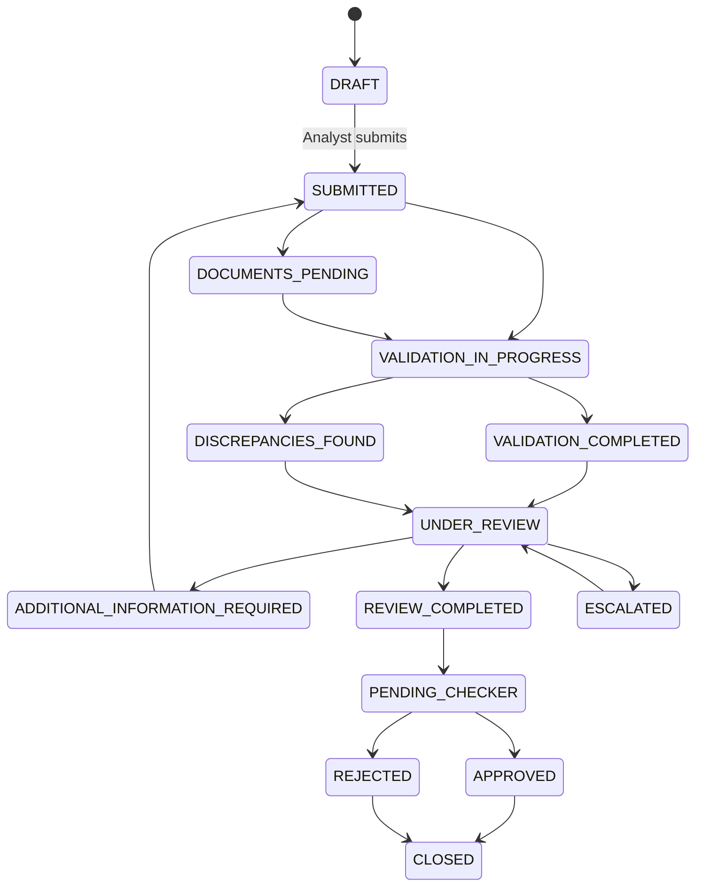
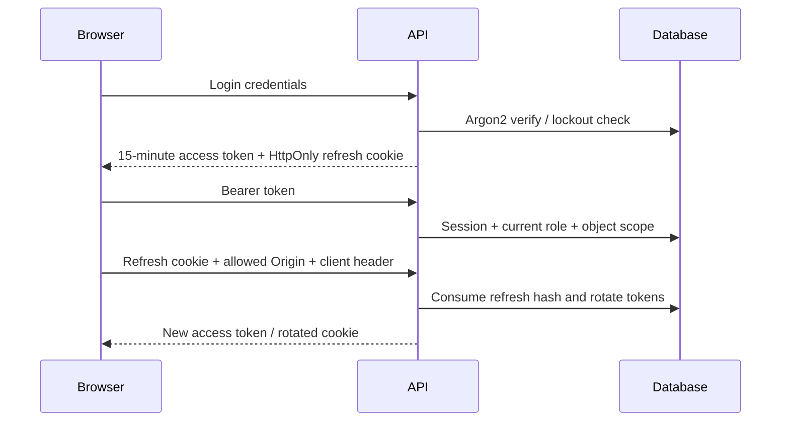

# Architecture

## Design

This is a modular monolith: one transactional API, a separate deterministic rule package, a React client, and a bounded local worker. PostgreSQL is the deployment database; SQLite is a documented single-process convenience profile. There is no real email, bank or AI integration.

| Owner | Responsibility |
|---|---|
| `backend/app/auth.py`, `security.py` | Session issuance/rotation, password checks, role permissions, case scope |
| `cases.py` | Typed request boundaries and LC/document/discrepancy routes |
| `services.py` | LC versioning, validation snapshots, workflow and approval invariants |
| `rules_engine/engine.py` | Pure decimal/date/normalization checks and risk contributions |
| `documents.py` | Signature checks, size/type limits, synthetic extraction provider |
| `audit.py` | Canonical hash payloads, serialized append, integrity verification |
| `providers.py`, `jobs.py` | In-app delivery, mock email outbox, SLA signals and bounded retries |
| `admin.py`, `reports.py` | Governance and controlled reporting |
| `frontend/src/api.ts` | In-memory bearer token and shared refresh promise |
| `frontend/src/case.tsx` | Case editing, evidence, workflow, simulation and human decisions |

## Persistence

Users, sessions, consumed refresh hashes, LCs, LC versions, documents, rule configuration/history, validation runs, discrepancies, approvals, notes, audit events/head, notifications, settings, outbox records and incidents have relational identities and foreign keys. Case metadata lives on the LC aggregate. Versioned terms, structured document fields, rule results and frozen snapshots use JSON because they are atomic evidence structures. This is not a claim that every conceptual table from the master prompt has a separate SQL table.

Money uses `Decimal` during validation and serializes as decimal strings. Dates use ISO date values. Operational timestamps are UTC-naive in storage and interpreted as UTC at the client. Each document row is an immutable logical version; replacement inserts another row with a unique `(lc_id,type,version)` and a duplicate-resistant `(lc_id,sha256)` constraint. File bytes live in the database for atomicity, not user-named filesystem paths.

LC `version` covers concurrency. `terms_version` covers business meaning. Editing evidence/terms is allowed only before validation or following an information request. Updating terms stores a new snapshot. Approval depends on current version, current validation input hash, a complete review checklist and a checker distinct from maker, submitter and reviewer.

## Validation reproducibility

The fingerprint contains terms, term version, latest document versions/hashes/fields, effective date, rule configurations and engine version. Identical fingerprints reuse the run. Persisted results retain input and configuration snapshots. A historical source checkout of engine `1.0` is required to reproduce its exact code semantics after future engine changes. Date-dependent approval requires current-day validation.

Required-document, expired-credit and presentation-expiry controls are independently evaluated at approval even if a configurable catalog rule has been disabled or downgraded. Every current failed rule needs either corrected evidence/revalidation or an authorized waiver; critical findings are non-waivable. The risk score remains the system score after a waiver.

## Transactions and concurrency

Requests commit as a unit; failures roll back. SQLAlchemy version counters reject stale LC changes. PostgreSQL `SELECT FOR UPDATE` locks business aggregates; SQLite relies on write serialization and optimistic version checks. Duplicate-run, document-version and file-hash constraints provide additional protection.

Audit writers update a singleton head before appending. That row serializes writers and stores the expected chain length/head. Integrity verification checks every canonical event, predecessor link, sequence and final head. Ordinary APIs provide no audit update/delete. A privileged database attacker could rewrite the entire chain and head: this is tamper evidence, not WORM storage or external cryptographic notarization.

In-app notices and outbox rows commit together with business changes. The worker consumes up to 100 pending items with row locks, records attempts, retries with exponential backoff and stops after three failures. The shipped mock provider never sends email. Validation/reporting remain synchronous and bounded to the demo workload.

## Flows

## Engineering references

Authentication concepts were checked against [FastAPI security documentation](https://fastapi.tiangolo.com/tutorial/security/oauth2-jwt/). This implementation deliberately uses database-backed opaque tokens instead of JWT to make revocation immediate without signing secrets. Optimistic locking follows [SQLAlchemy's version counter](https://docs.sqlalchemy.org/en/20/orm/versioning.html).
