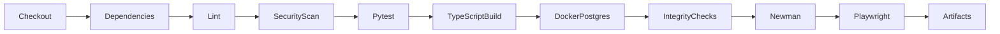

# QA strategy

Test priority follows business risk: unauthorized decisions and evidence integrity first, rule boundary correctness second, transactional workflows third, then presentation and exports.

## Levels and scope

1. Pure rule unit tests cover amount tolerance boundaries, date boundaries, every rule family, normalized names, missing evidence and risk factor sums.
2. API integration tests run against isolated temporary SQLite databases initialized with the same schema and synthetic role seed. Tests assert persisted outcomes, not only HTTP success.
3. Security regression tests cover role separation, IDOR on case/download/export/simulation, mass assignment, malformed JSON, hostile uploads, invalid monetary/date inputs, session revocation/replay, lockout and headers.
4. Concurrent requests verify one successful transition and preserved audit integrity. PostgreSQL isolation still needs execution in its deployment environment.
5. Newman exercises a generated dated document package, submission, validation/idempotency, reports, notifications and denial paths. Fixtures must be regenerated before runs.
6. Playwright exercises actual React-to-API journeys, independent logins, upload, approval, audit integrity, theme switching and administration. Screenshots are taken from the running app.
7. A five-client, fifty-request read probe reports local timing only. It is not a capacity promise.

## Entry / exit criteria

Entry: dependencies installed, migration succeeds, seed is deterministic for the current date, server is reachable, no real PII. Core exit: rule/API/security tests pass; browser full workflow passes; API collection assertions pass; database/audit verification passes; build and lint pass; known dependency exceptions and environmental gaps are explicit.

Coverage is reported using pytest-cov, not gamed to reach a headline. Python coverage does not imply browser or database-platform coverage. New privileged mutation routes require a permission test and audit check. Rule changes require boundary and negative-case regression. Recovery/outage checks use disposable data only.

## Defect lifecycle

New → reproduced → prioritized → fixed → regression-tested → closed. Blocking defects include unauthorized approval, evidence loss, incorrect amount/date boundary, an unverifiable audit chain or a non-starting application. UI label issues are fixed before accepting the browser journey. Records in DEFECTS.md represent observed defects, not invented production incidents.

## Evidence

`data/pytest-results.xml`, `data/coverage.xml`, `data/newman-results.xml`, `data/playwright-results.xml`, `data/playwright-report/`, `data/load-results.json`, `docs/screenshots/`. These are regenerated. Browser network tracing is disabled to avoid retaining authentication payloads; `data/` remains ignored.

## CI

CI configuration is provided. A passing local run is not a claim that GitHub Actions has already run in a hosted repository.
