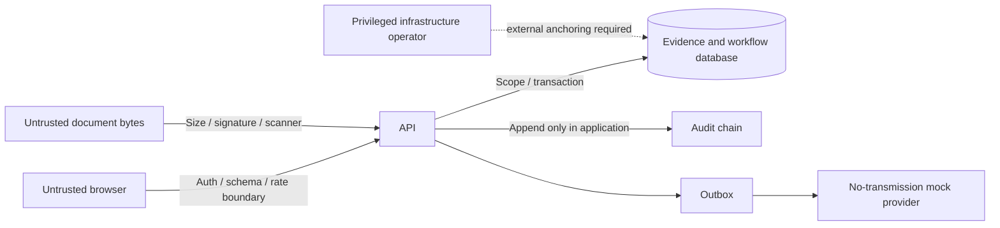

# Threat model

Assets: synthetic evidence, case state, approval identity, password hashes, token hashes, rule history, audit chain, exports and local configuration. Actors: authorized personas, compromised accounts, anonymous clients, hostile file submitters, privileged infrastructure operators and compromised dependencies.

Trust boundaries: browser/API; authenticated actor/object scope; untrusted bytes/extraction; API/database; workflow/human decision; application audit/infrastructure administrators; application/dev tooling.

| Threat | Implemented control | Residual / next control |
|---|---|---|
| SQL injection | ORM bound parameters; fixed sort allowlist | Independent assessment and least-privilege DB account |
| XSS / stored notes | React text escaping; PDF escaping; CSP | Formal frontend security review |
| CSRF | Bearer writes; strict refresh cookie, Origin/custom header checks | Production TLS and proxy review |
| SSRF | No user-provided URL fetch or live provider | Provider-specific egress policies before integrations |
| IDOR/BOLA | Shared scope checks on cases, files, simulation, exports | Multi-tenant policies before more organizations |
| Brute force/credential stuffing | Account lockout, dummy password hash, IP buckets | Distributed gateway throttling, identity-provider defenses |
| Session hijack / replay | Short access life, token hashes, rotation, replay revocation | MFA, device assurance, secure endpoint environment |
| JWT misuse | Opaque server-side sessions; no JWT signature bypass surface | IAM token validation when OIDC is added |
| Mass assignment | Strict models; privileged fields absent from LC writes | Keep all future endpoints typed |
| Path traversal/executables | No paths accepted; signature/extension allowlist; DB bytes | Production malware/CDR gateway |
| ZIP bombs | ZIP unsupported; strict raw body/file caps | Decompression limits for future office formats |
| Malicious PDF/image | Attachment downloads, sandbox CSP, demo marker scanner | Full parser validation, AV and isolated rendering |
| API abuse / size attacks | Bounded pages/exports, streamed body cap, rate limits | Distributed quotas, connection limits, admission control |
| Privilege escalation | Server role matrix; admin cannot approve; session revocation | Enterprise identity governance and access reviews |
| Audit tampering | Hash links, sequence checks, serialized head, no mutation API | External immutable anchor/WORM; DB superuser can rewrite chain |
| Race / duplicate approval | Case locks, optimistic versions, unique constraints | PostgreSQL concurrency/load certification |
| Token/password logs | Controlled structured logs; safe errors; access logs disabled | SIEM field controls and log-content scans |
| Export exfiltration / CSV formula | Scoped export permission, audit, CSV prefix handling | DLP, reviewed data-release workflow |
| Supply-chain compromise | Lockfiles, scans, isolated Newman package | Signed artifacts, SBOM, review advisories continuously |
| Prompt injection | No AI execution; file fields are untrusted data | Typed provider boundary, no tool authority for document text |
| Config change invalidates decision | Frozen policy versions; approval requires current fingerprint | Formal policy release and effective-date governance |
| Notification provider outage | Transactional outbox, bounded retries/dead state | Real delivery idempotency and alerting |

